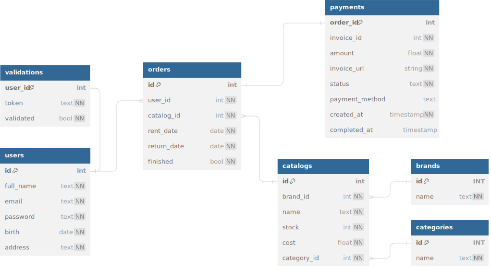

# carStruck

[Feel free to try this API. Click to access the documentation.](https://carstruck.fly.dev)

## Description:

### Background:

> Renting a car should be hassle free. Looking from current situation in Indonesia, we often rent a car via WhatsApp and manual bank transfer. Sure there are many digital rental car platform, but most of the time they're owned by big companies. Small car rental companies usually cost less and much more flexible to deal with. CarStruck saw that small rental companies could be integrated with a single application, thus giving a win-win solution to the customer and seller.

## Highlights:

* Docker Deployment with Fly.io
* Google Maps (useful to pinpoint car delivery location)
* Payment Gateway (Xendit with webhook callback)
* Email verification for newly registered user

### Tech stacks:

* Go
* Echo
* PostgreSQL
* JWT-Authorization (Cookie Authorization)
* 3rd Party APIs (Xendit, Google Maps Static)
* SMTP
* REST
* Swagger
* Testify

### Entity Relationship Diagram

### Room for Improvements:

Since this is only a prototype, there are so many room for improvements. Feel free to fork and make a pull request if you feel like improving it!